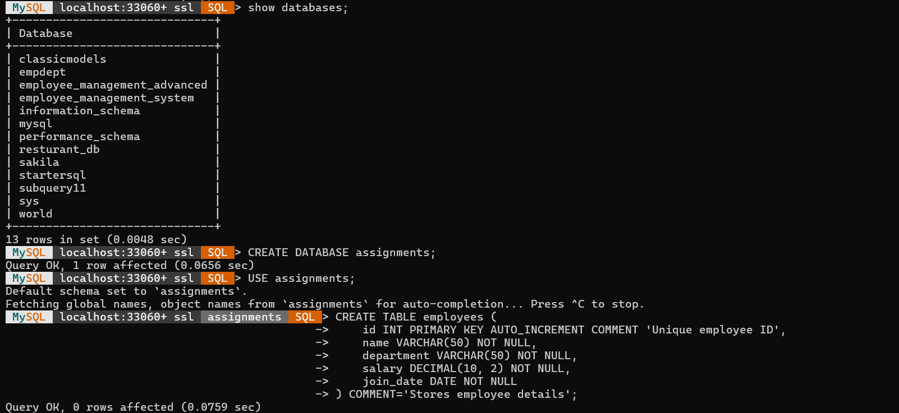
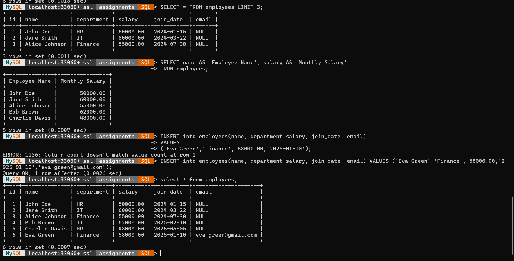
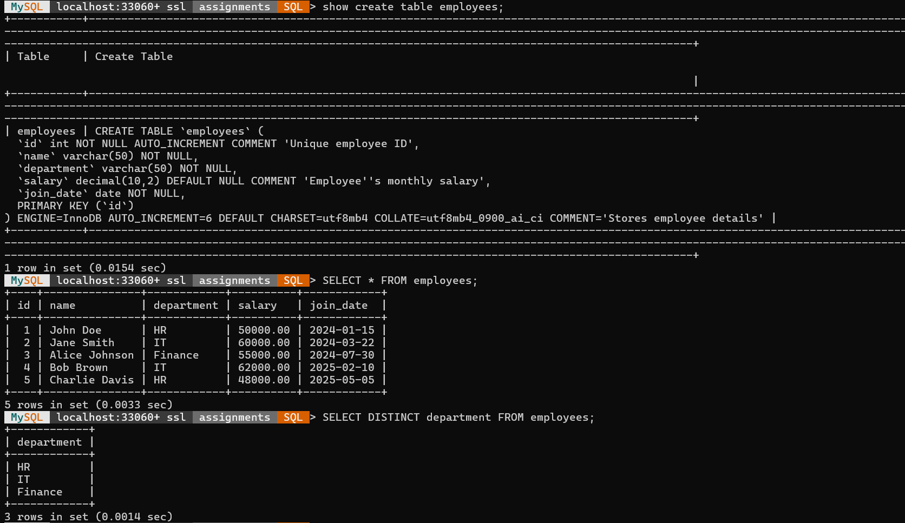
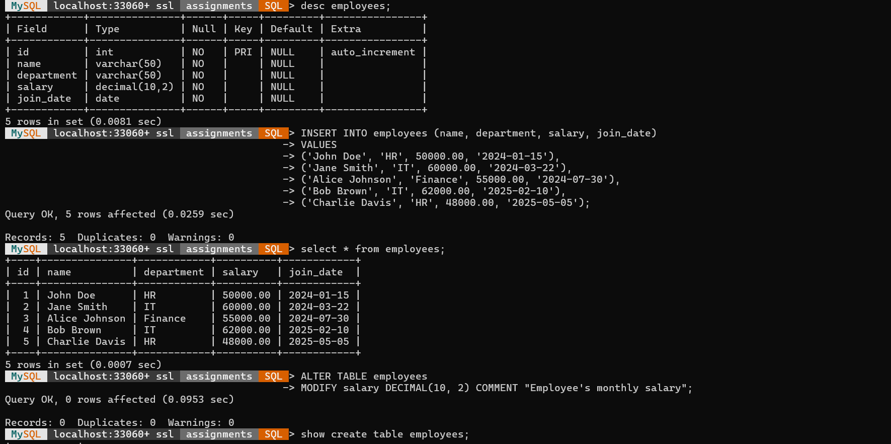

# 🗄️ Employee Management System --- MySQL

A beginner-friendly MySQL project demonstrating essential SQL operations
for creating and managing an employee database.

## 📌 Description

This project demonstrates how to create a MySQL database and employee
table, insert and manage employee records, modify table structures, and
retrieve data using commonly used SQL queries.

## 🛠️ Technologies Used

-   **MySQL**
-   **SQL**
-   **MySQL Workbench / MySQL Command Line**

## 📚 Concepts Covered

-   Database creation
-   Table creation
-   Primary Key
-   `AUTO_INCREMENT`
-   `NOT NULL`
-   `VARCHAR`
-   `DECIMAL`
-   `DATE`
-   `INSERT INTO`
-   `SELECT`
-   `WHERE`
-   `DISTINCT`
-   `ALTER TABLE`
-   `LIMIT`
-   Column aliases using `AS`
-   Column comments

## 🗂️ Database Structure

**Database:** `employee_management`

**Table:** `employees`

  Column         Data Type         Description
  -------------- ----------------- -----------------------
  `id`           `INT`             Unique employee ID
  `name`         `VARCHAR(50)`     Employee name
  `department`   `VARCHAR(50)`     Employee department
  `salary`       `DECIMAL(10,2)`   Monthly salary
  `join_date`    `DATE`            Employee joining date
  `email`        `VARCHAR(100)`    Employee email

## 💻 SQL Operations

### Create Database

``` sql
CREATE DATABASE employee_management;
USE employee_management;
```

### Create Employees Table

``` sql
CREATE TABLE employees (
    id INT PRIMARY KEY AUTO_INCREMENT,
    name VARCHAR(50) NOT NULL,
    department VARCHAR(50) NOT NULL,
    salary DECIMAL(10, 2) NOT NULL,
    join_date DATE NOT NULL
);
```

### Insert Employee Records

The project includes sample employee records from different departments
such as HR, IT, and Finance.

### Retrieve Data

``` sql
SELECT * FROM employees;
```

### Find Unique Departments

``` sql
SELECT DISTINCT department FROM employees;
```

### Filter Employees

``` sql
SELECT * FROM employees
WHERE department = 'IT';
```

### Add Email Column

``` sql
ALTER TABLE employees
ADD COLUMN email VARCHAR(100);
```

### Display Limited Records

``` sql
SELECT * FROM employees
LIMIT 3;
```

### Use Column Aliases

``` sql
SELECT name AS 'Employee Name',
       salary AS 'Monthly Salary'
FROM employees;
```

## 📸 Screenshots

Screenshots of the SQL queries and their execution results can be added
below.

### Database & Table Creation



### Employee Data



### Filtering & DISTINCT Queries






## 📁 Project Structure

``` text
employee-management-mysql/
│
├── assignment1,13.08.2026.sql
├── README.md
└── screenshots/
    ├── database-table.png
    ├── employee-data.png
    ├── filtering.png
    ├── email-column.png
    └── aliases.png
```

## 🎯 Learning Objective

The main objective of this project is to build a practical understanding
of basic MySQL database operations and become familiar with writing and
executing SQL queries for managing structured employee data.

## 👨‍💻 Author

**Tuhin Roy**
